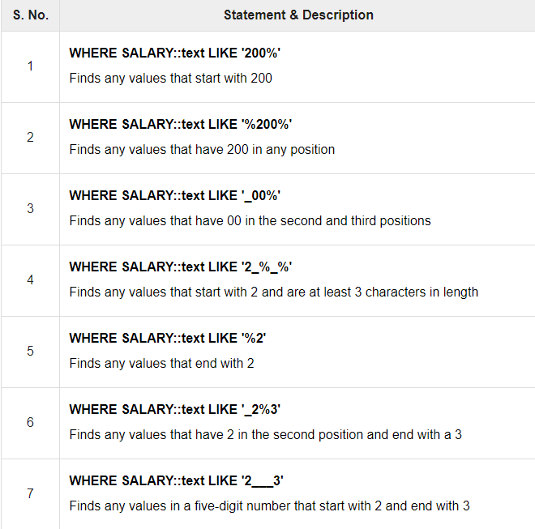

# Introduction

- Clauses are in-built functions available to us in SQL.
- With the help of clauses, we can deal with data easily stored in the table.
- It helps us filter and analyze data quickly.
- When we have large amounts of data stored in the database, we use clauses _to query and get data required by the user_.
- The different types of clauses are :
  1. `WHERE`
  2. `AND` and `OR`
  3. `LIKE`
  4. `LIMIT`
  5. `ORDER BY` and `GROUP BY`
  6. `WITH`
  7. `HAVING`

## Where clause

- The PostgreSQL `WHERE` clause is used to specify a condition while fetching the data from single table or joining with multiple tables.
- If the given condition is satisfied, only then it returns specific value from the table.
- You can filter out rows that you do not want included in the result-set by using the `WHERE` clause.

### Syntax

```postgresql
SELECT col[1], col[2], col[3]
FROM <table_name>
WHERE [condition];
```

## And Or clauses

- The PostgreSQL `AND` and `OR` operators are used to combine multiple conditions to narrow down selected data in a PostgreSQL statement.
- These two operators are called _conjunctive operators_.

### Syntax

1. `AND`

   ```postgresql
    SELECT col[1], col[2], col[3]
    FROM <table_name>
    WHERE [condition[1]] AND [condition[2]];
   ```

2. `OR`

   ```postgresql
   SELECT col[1], col[2], col[3]
   FROM <table_name>
   WHERE [condition[1]] OR [condition[2]];
   ```

## Like clause

- The PostgreSQL `LIKE` operator is used to match text values against a pattern which works similar to _regex_ by usng _wildcards_.
- If the search expression can be matched to the pattern expression, the `LIKE` operator will return `true`, which is `1`.
- There are two _wildcards_ used in conjunction with the `LIKE` operator −
  1. The percent sign `%`
  2. The underscore `_`
- The percent sign represents zero, one, or multiple numbers or characters.
- The underscore represents a single number or character.
- These symbols can be used in combinations.
- If either of these two signs is not used in conjunction with the `LIKE` clause, then it acts like the equals operator.

### Syntax

1. Using percent :

   ```postgresql
    SELECT col[1], col[2], col[3]
    FROM <table_name>
    WHERE col[n] LIKE '%';
   ```

2. Using underscore :

   ```postgresql
    SELECT col[1], col[2], col[3]
    FROM <table_name>
    WHERE col[n] LIKE '_';
   ```

### Reference



## Limit clause

- The PostgreSQL `LIMIT` clause is used to limit the data amount returned by the `SELECT` statement.

### Syntax

1. Without `OFFSET`

   ```postgresql
   SELECT col[1], col[2], col[3]
   FROM <table_name>
   LIMIT [no_of_rows];
   ```

2. With `OFFSET`

   ```postgresql
   SELECT col[1], col[2], col[3]
   FROM <table_name>
   LIMIT [no_of_rows] OFFSET [table_row, num];
   ```

### Example

- Consider a **table** in _PostgreSQL database_ :

  | id  | name  | age | address    | salary |
  | --- | ----- | --- | ---------- | ------ |
  | 1   | Paul  | 32  | California | 20000  |
  | 2   | Allen | 25  | Texas      | 15000  |
  | 3   | Teddy | 23  | Norway     | 20000  |
  | 4   | Mark  | 25  | Rich-Mond  | 65000  |
  | 5   | David | 27  | Texas      | 85000  |
  | 6   | Kim   | 22  | South-Hall | 45000  |
  | 7   | James | 24  | Houston    | 10000  |

- Running this command :

  ```postgresql
   SELECT *
   FROM company
   LIMIT 4;
  ```

- This will produce :

  | id  | name  | age | address    | salary |
  | --- | ----- | --- | ---------- | ------ |
  | 1   | Paul  | 32  | California | 20000  |
  | 2   | Allen | 25  | Texas      | 15000  |
  | 3   | Teddy | 23  | Norway     | 20000  |
  | 4   | Mark  | 25  | Rich-Mond  | 65000  |

- If we want to pick up a set of records from a particular offset :

  ```postgresql
   SELECT *
   FROM company
   LIMIT 2 OFFSET 5;
  ```

- It will produce :

  | id  | name  | age | address    | salary |
  | --- | ----- | --- | ---------- | ------ |
  | 6   | Kim   | 22  | South-Hall | 45000  |
  | 7   | James | 24  | Houston    | 10000  |

## Order clause

- The PostgreSQL `ORDER BY` clause is used to sort the data in ascending or descending order, based on one or more columns.

### Syntax

```postgresql
SELECT col[1], col[2], col[3]
FROM <table_name>
WHERE [condition]
ORDER BY [col[1], col[2]] [ ASC | DESC ]
```

## Group clause

- The PostgreSQL `GROUP BY` clause is used in collaboration with the `SELECT` statement to group together those rows in a table that have identical data.
- This is done to eliminate redundancy in the output and/or compute aggregates that apply to these groups.
- The `GROUP BY` clause follows the `WHERE` clause in a `SELECT` statement and precedes the ORDER BY clause.

### Syntax

```postgresql
SELECT col[1], col[2], col[3]
FROM <table_name>
WHERE [condition]
GROUP BY [col[1], col[2]]
ORDER BY [col[1], col[2]] [ ASC | DESC ]
```

## With clause

- In PostgreSQL, the `WITH` query provides a way to write auxiliary statements for use in a larger query.
- It helps in breaking down complicated and large queries into simpler forms, which are easily readable.
- These statements often referred to as _Common Table Expressions_ or _CTEs_, can be thought of as defining temporary tables that exist just for one query.
- The WITH query being CTE query, is particularly useful when subquery is executed multiple times.
- It is equally helpful in place of temporary tables.
- It computes the aggregation once and allows us to reference it by its name (may be multiple times) in the queries.

### Syntax

```postgresql
WITH
   name_for_data AS (
      SELECT [smt])
   SELECT col[1], col[2]
   FROM <table_name>
   WHERE [condition] (
      SELECT col[1], col[2]
      FROM name_for_data)
   ORDER BY col[1], col[2] [ ASC | DESC ]
```

### Note

- The WITH clause must be defined before it is used in the query.

## Having clause

- The `HAVING` clause allows us to pick out particular rows where the function's result meets some condition.
- The `WHERE` clause places conditions on the selected columns, whereas the `HAVING` clause places conditions on groups created by the `GROUP BY` clause.

### Syntax

```postgresql
SELECT col[1], col[2], col[3]
FROM <table_name>
WHERE [condition]
GROUP BY [col[1], col[2]]
HAVING [condition]
ORDER BY [col[1], col[2]] [ ASC | DESC ]
```

### Example

- Consider a **table** in _PostgreSQL database_ :

  | id  | name  | age | address    | salary |
  | --- | ----- | --- | ---------- | ------ |
  | 1   | Paul  | 32  | California | 20000  |
  | 2   | Allen | 25  | Texas      | 15000  |
  | 3   | Teddy | 23  | Norway     | 20000  |
  | 4   | Mark  | 25  | Rich-Mond  | 65000  |
  | 5   | David | 27  | Texas      | 85000  |
  | 6   | Kim   | 22  | South-Hall | 45000  |
  | 7   | James | 24  | Houston    | 10000  |

- Running this command :

  ```postgresql
  SELECT name FROM company GROUP BY name HAVING count(name) < 2;
  ```

- This command will check if `name` occurs lesser than `2` in the table. 
- Since all the names in the `name` column is unique, _7 rows_ are shown as a result.
- If we change the table as :

  | id  | name  | age | address    | salary |
  | --- | ----- | --- | ---------- | ------ |
  | 1   | Paul  | 32  | California | 20000  |
  | 2   | Allen | 25  | Texas      | 15000  |
  | 3   | Teddy | 23  | Norway     | 20000  |
  | 4   | Mark  | 25  | Rich-Mond  | 65000  |
  | 5   | David | 27  | Texas      | 85000  |
  | 6   | Kim   | 22  | South-Hall | 45000  |
  | 7   | James | 24  | Houston    | 10000  |
  | 8   | Paul  | 24  | Houston    | 20000  |
  | 9   | James | 44  | Norway     | 5000   |
  | 10  | James | 45  | Texas      | 5000   |

- Running this command :

  ```postgresql
  SELECT name FROM company GROUP BY name HAVING count(name) > 1;
  ```

- This command will check if `name` occurs more than once in the table. 
- Since all the names in the `name` column is unique, _7 rows_ are shown as a result.
- The result will be :
  ```postgresql
   name
  -------
   Paul
   James
  (2 rows)
  ```
