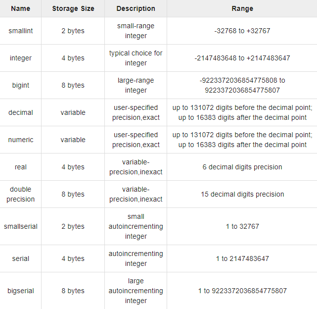
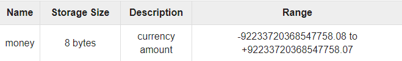
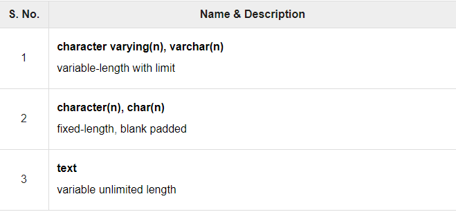
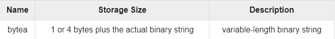
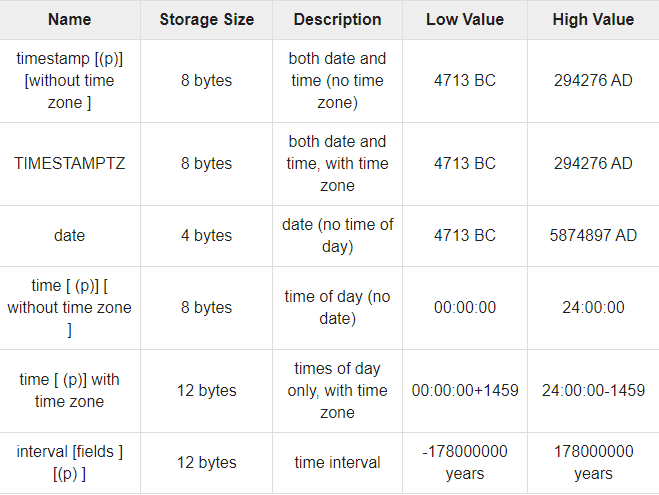
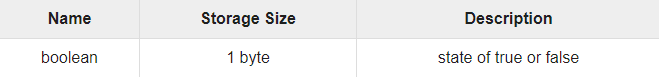
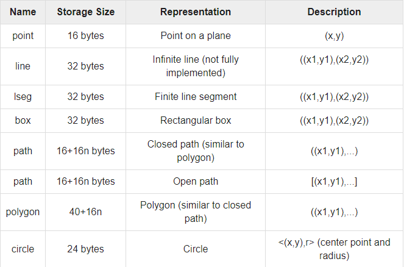
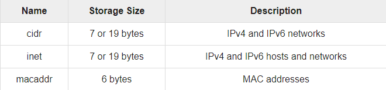
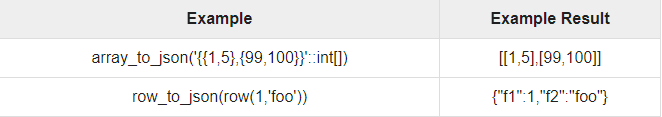

# Introduction

- PostgreSQL supports a wide set of Data Types.
- Besides, users can create their own custom data type using `CREATE TYPE { SQL }` command.
- There are different categories of data types in PostgreSQL.

### Numeric Data Type



### Monetary Data Type



### Character Data Type



### Binary Data Type



### Date/Time Data Type



### Boolean Data Type



### Enumerated Data Type

- Enumerated (enum) types are data types that comprise a static, ordered set of values.
- They are equivalent to the enum types supported in a number of programming languages.
- For instance :

```postgresql
CREATE TYPE days AS ENUM("Mon", "Tue", "Wed", "Thu", "Fri", "Sat", "Sun" );
```

### Geometric Data Type

- They represent two dimensional spatial objects :
  

### Network Data Type

- They represent two dimensional spatial objects :
  

### JSON Data Type


