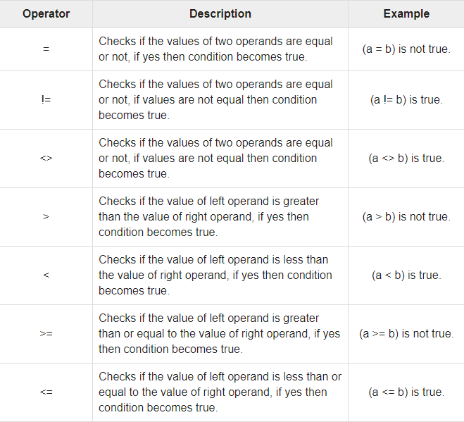
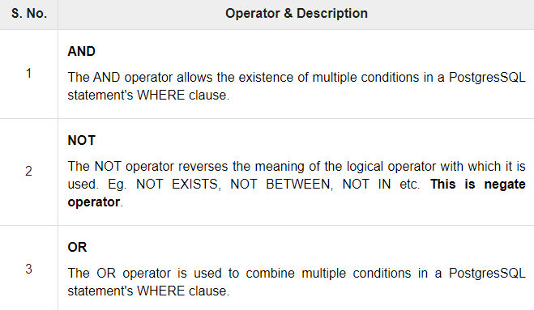

# Introduction

- An operator is a reserved word or a character used primarily in a PostgreSQL statement's `WHERE` clause to perform operation, such as _comparisons_ and _arithmetic operations_.
- Operators are used to specify conditions in a PostgreSQL statement and to serve as conjunctions for multiple conditions in a statement.
- They are :
  1. Arithmetic operators
  2. Comparison operators
  3. Logical operators
  4. Bitwise operators

## Aritmetic operators

- Let `a = 2` and `b = 3`
  

## Comparison operators

- Let `a = 10` and `b = 20`
  

## Logical operators

---

## Image source

[Tutorialspoint Official website](https://www.tutorialspoint.com/)
